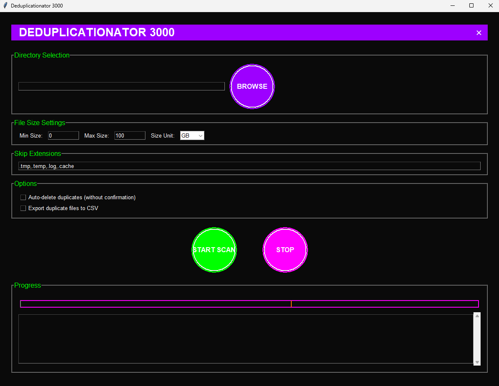

# Deduplicationator 3000

A futuristic GUI application for finding and removing duplicate files with a cyberpunk aesthetic.

## Features

- 🎨 Cyberpunk-inspired GUI with animated elements
- 🔍 Smart file detection using SHA-256 hashing
- ⚡ Multi-threaded processing for better performance
- 📊 Real-time progress tracking with animated progress bar
- 💾 CSV export of duplicate file information
- 🎯 Configurable file size limits
- 🎨 Customizable file extension filters
- 🔄 Batch processing for better performance
- 📈 Detailed progress and statistics

## Screenshots



## Installation

### Quick Install

1. Download the latest release from the [Releases](https://github.com/huntrezzjanos/Deduplicationator-3000/releases) page
2. Run the installer for your operating system

### Build from Source

1. Clone the repository:
```bash
git clone https://github.com/huntrezzjanos/Deduplicationator-3000.git
cd deduplicationator-3000
```

2. Install dependencies:
```bash
pip install -r requirements.txt
```

3. Build the executable:
```bash
python setup.py build
```

### Manual Installation

1. Ensure you have Python 3.6 or higher installed
2. Install the required packages:
```bash
pip install psutil cx_Freeze pillow tqdm colorama
```

3. Run the program:
```bash
python cleanup_duplicates.py
```

## Usage

1. Launch the application
2. Select a directory to scan
3. Configure size limits and file filters if needed
4. Choose whether to auto-delete duplicates or export to CSV
5. Click "START SCAN" to begin
6. Review and confirm duplicate deletions
7. Check the progress window for results

## Configuration

- **File Size Limits**: Set minimum and maximum file sizes to scan
- **Skip Extensions**: Specify file extensions to ignore
- **Auto-delete**: Enable to automatically delete duplicates without confirmation
- **CSV Export**: Enable to export duplicate information to a CSV file

## Safety Features

- Confirmation dialogs before deletion
- Keeps the most recently modified file
- Detailed logging of all operations
- CSV export for review before deletion

## Troubleshooting

### Common Issues

1. **Program won't start**
   - Ensure Python 3.6+ is installed
   - Check all dependencies are installed
   - Verify you have write permissions

2. **Slow performance**
   - Reduce the batch size
   - Exclude more file extensions
   - Increase minimum file size

3. **Memory issues**
   - Increase minimum file size
   - Reduce batch size
   - Close other applications

## Contributing

1. Fork the repository
2. Create a feature branch
3. Commit your changes
4. Push to the branch
5. Create a Pull Request

## License

This project is licensed under the MIT License - see the [LICENSE](LICENSE) file for details.

## Acknowledgments

- Inspired by cyberpunk aesthetics
- Built with Python and Tkinter
- Uses various open-source libraries

## Support

If you encounter any issues or have questions, please:
1. Check the [Issues](https://github.com/yourusername/deduplicationator-3000/issues) page
2. Create a new issue if your problem isn't listed
3. Include as much detail as possible in your report 