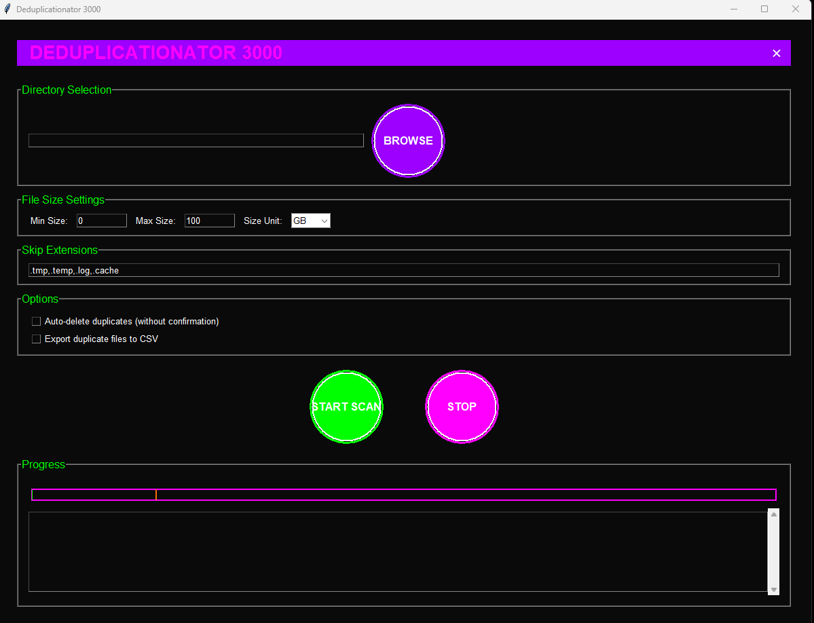

# Deduplicationator 3000

[](https://github.com/huntrezzjanos/deduplicationator-3000/actions/workflows/build.yml)
[](https://github.com/huntrezzjanos/deduplicationator-3000/releases)
[](LICENSE)

A futuristic GUI application for finding and removing duplicate files with a cyberpunk aesthetic.

## Features

- 🎨 Cyberpunk-inspired GUI with animated elements
- 🔍 Smart file detection using SHA-256 hashing
- ⚡ Multi-threaded processing for better performance
- 📊 Real-time progress tracking with animated progress bar
- 💾 CSV export of duplicate file information
- 🎯 Configurable file size limits
- 🎨 Customizable file extension filters
- 🔄 Batch processing for better performance
- 📈 Detailed progress and statistics

## Screenshots



## Quick Start Guide

### Option 1: Download Pre-built Version (Recommended)
1. Go to the [Releases](https://github.com/huntrezzjanos/deduplicationator-3000/releases) page
2. Download `Deduplicationator3000-Setup.exe` from the latest release
3. Run the installer and follow the on-screen instructions
4. Launch the program from your desktop or start menu

### Option 2: Manual Installation

#### Prerequisites
- Windows 10 or later
- Python 3.6 or higher
- Administrator privileges

#### Installation Steps
1. Download the source code:
   - Click the green "Code" button above
   - Select "Download ZIP"
   - Extract the ZIP file to a location of your choice

2. Run the installer:
   - Right-click on `install.bat`
   - Select "Run as administrator"
   - Wait for the installation to complete
   - The program will be available in the `build` folder

3. First-time setup:
   - Navigate to the `build` folder
   - Double-click `Deduplicationator3000.exe`
   - If Windows SmartScreen appears, click "More info" then "Run anyway"

### Option 3: Build from Source (For Developers)

1. Clone the repository:
```bash
git clone https://github.com/huntrezzjanos/Deduplicationator-3000.git
cd deduplicationator-3000
```

2. Install dependencies:
```bash
pip install -r requirements.txt
```

3. Build the executable:
```bash
python setup.py build
```

## Troubleshooting

### Common Installation Issues

1. **"Access is denied" error**
   - Right-click the installer and select "Run as administrator"
   - Ensure you have write permissions in the installation directory

2. **Python not found**
   - Download and install Python from [python.org](https://www.python.org/downloads/)
   - Make sure to check "Add Python to PATH" during installation

3. **Missing dependencies**
   - Run `pip install -r requirements.txt` manually
   - If using Option 1, try downloading the latest release again

4. **Windows SmartScreen warning**
   - Click "More info"
   - Click "Run anyway"
   - This is normal for newly created applications

### Need Help?
- Check the [Issues](https://github.com/huntrezzjanos/deduplicationator-3000/issues) page
- Create a new issue if your problem isn't listed
- Include your Windows version and any error messages

## Usage

1. Launch the application
2. Select a directory to scan
3. Configure size limits and file filters if needed
4. Choose whether to auto-delete duplicates or export to CSV
5. Click "START SCAN" to begin
6. Review and confirm duplicate deletions
7. Check the progress window for results

## Configuration

- **File Size Limits**: Set minimum and maximum file sizes to scan
- **Skip Extensions**: Specify file extensions to ignore
- **Auto-delete**: Enable to automatically delete duplicates without confirmation
- **CSV Export**: Enable to export duplicate information to a CSV file

## Safety Features

- Confirmation dialogs before deletion
- Keeps the most recently modified file
- Detailed logging of all operations
- CSV export for review before deletion

## Contributing

1. Fork the repository
2. Create a feature branch
3. Commit your changes
4. Push to the branch
5. Create a Pull Request

## License

This project is licensed under the MIT License - see the [LICENSE](LICENSE) file for details.

## Acknowledgments

- Inspired by cyberpunk aesthetics
- Built with Python and Tkinter
- Uses various open-source libraries

## Support

If you encounter any issues or have questions, please:
1. Check the [Issues](https://github.com/huntrezzjanos/deduplicationator-3000/issues) page
2. Create a new issue if your problem isn't listed
3. Include as much detail as possible in your report 